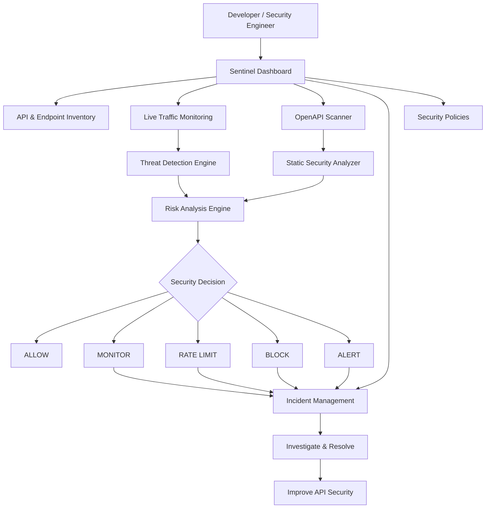
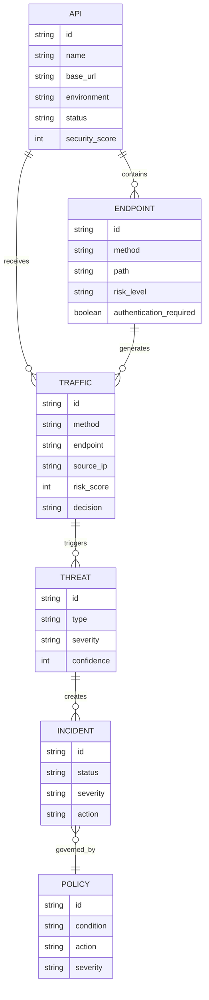
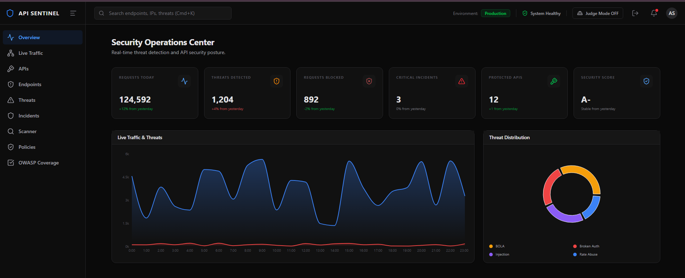
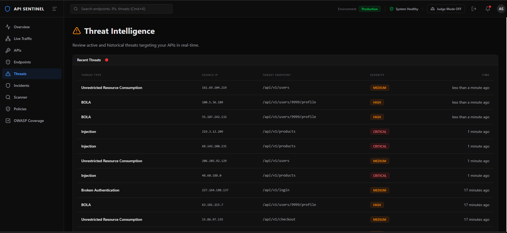
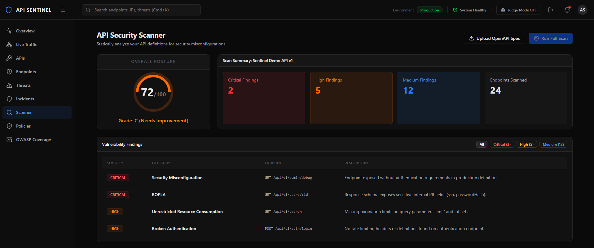
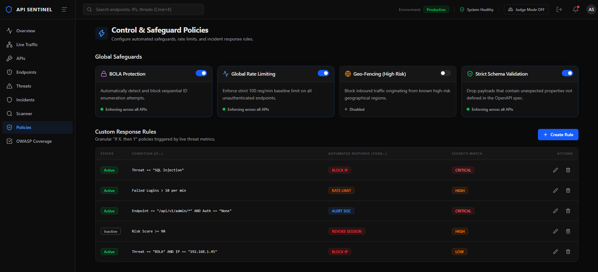

# 🛡️ Sentinel

## Intelligent API Security Monitoring & Vulnerability Detection Platform

> **Observe. Detect. Assess. Respond. Secure.**

Sentinel is an API security platform designed to help developers and security teams discover, monitor, analyze, and protect APIs against vulnerabilities, malicious requests, and abnormal behavior.

It combines **API inventory, OpenAPI security scanning, real-time traffic monitoring, threat detection, risk scoring, policy-based response, and incident management** into a unified security dashboard.

---

# 🚨 Hackathon Track

**Cybersecurity – API Security & Threat Control**

## Problem Statement

> **Build an automated tool to detect, prevent, and respond to API security threats in real time.**

---

# 🎯 The Problem

Modern applications heavily depend on APIs, making them a major attack surface.

Attackers can exploit:

- Broken authentication
- Broken authorization
- Excessive data exposure
- Injection vulnerabilities
- Missing rate limits
- API abuse
- Security misconfiguration
- Resource exhaustion
- SSRF
- Improper API inventory

These attacks can expose sensitive information, abuse business functionality, or compromise user accounts without immediately triggering traditional security alarms.

The challenge is not only detecting vulnerabilities, but also understanding **what is happening, how risky it is, and what action should be taken**.

---

# 💡 Our Solution — Sentinel

Sentinel provides a unified security workflow:

```text
                 ┌─────────────────────┐
                 │      API SOURCE     │
                 └──────────┬──────────┘
                            │
              ┌─────────────┴─────────────┐
              │                           │
              ▼                           ▼
       OpenAPI Specification         Live API Traffic
              │                           │
              ▼                           ▼
       Security Scanner            Threat Detection
              │                           │
              └─────────────┬─────────────┘
                            ▼
                     Risk Analysis
                            │
                            ▼
                    Security Decision
                            │
             ┌──────────────┼──────────────┐
             ▼              ▼              ▼
           ALLOW         MONITOR        BLOCK
                            │
                            ▼
                      RATE LIMIT / ALERT
                            │
                            ▼
                   Incident Management
                            │
                            ▼
                     Secure API
```

Sentinel combines **Shift-Left API Security** with **Runtime API Security**.

---

# 🔍 How Sentinel Works

## 1. Discover & Inventory APIs

Sentinel provides visibility into protected APIs and their endpoints.

API information includes:

```text
API Name
Base URL
Environment
Status
Endpoint Count
Requests in 24h
Threats in 24h
Security Score
Last Activity
```

Endpoint information includes:

```text
HTTP Method
Path
Authentication Required
Roles
Risk Level
Request Volume
Threat Count
Last Seen
```

This helps security teams understand their complete API attack surface.

---

# 2. 📡 Monitor Live API Traffic

Sentinel monitors API requests and analyzes security-relevant signals.

Each request can contain:

```text
HTTP Method
Endpoint
Status Code
Source IP
User / Session
Risk Score
Decision
Threat Type
Headers
Query Parameters
Response Latency
```

Example:

```text
GET /api/v1/users
Status: 200
Risk Score: 8
Decision: ALLOW
```

Suspicious request:

```text
GET /api/v1/users/9999/profile
Risk Score: 92
Threat: BOLA
Decision: BLOCK
Status: 403
```

---

# 3. 🚨 Detect API Threats

Sentinel analyzes API behavior and security signals to identify suspicious activity.

### Threat Coverage

| Threat | Example | Possible Response |
|---|---|---|
| BOLA | Unauthorized object access | BLOCK |
| Broken Authentication | Repeated failed logins | RATE LIMIT |
| BOPLA | Unauthorized object properties | BLOCK / ALERT |
| Injection | Malicious input/query patterns | BLOCK |
| Resource Abuse | Abnormally high request rate | RATE LIMIT |
| Security Misconfiguration | Unsafe API configuration | ALERT |
| SSRF | Suspicious internal resource access | BLOCK / ALERT |
| BFLA | Unauthorized privileged operation | BLOCK |
| Improper Inventory | Undocumented/shadow endpoints | ALERT |
| Unsafe API Consumption | Risky external API interaction | ALERT |

---

# 4. 🔎 OpenAPI Security Scanner

Developers can upload an **OpenAPI JSON specification** and analyze the API before deployment.

```text
OpenAPI JSON
     ↓
Upload to Sentinel
     ↓
Static Security Analysis
     ↓
Security Rules
     ↓
Vulnerability Findings
     ↓
Risk Assessment
     ↓
Security Score
```

The scanner checks for issues such as:

- Missing authentication
- Sensitive information exposure
- Missing pagination
- Missing rate-limit definitions
- Security misconfiguration
- Risky endpoints

Example:

```text
Security Score: 72/100
Grade: C

CRITICAL
Broken Authentication
GET /api/v1/admin/debug

CRITICAL
Sensitive Data Exposure
GET /api/v1/users/:id

HIGH
Unrestricted Resource Consumption
GET /api/v1/search
```

---

# 5. 📊 Risk Scoring

Sentinel converts security findings into an understandable security score.

The scoring model starts from:

```text
100
```

Weighted deductions:

```text
Critical → -12
High     → -6
Medium   → -2
```

Therefore:

```text
100
 - Critical Findings
 - High Findings
 - Medium Findings
 = Security Score
```

### Security Grades

| Score | Grade |
|---:|:---:|
| 90–100 | A |
| 80–89 | B |
| 60–79 | C |
| 40–59 | D |
| <40 | F |

This gives developers and security teams a quick understanding of their API security posture.

---

# 6. ⚙️ Policy & Response Engine

Detection is only the first step.

Sentinel can associate detected threats with security policies and determine the appropriate response.

```text
Threat Detected
       ↓
Determine Severity
       ↓
Evaluate Security Policy
       ↓
Take Action
```

### Response Actions

```text
ALLOW
MONITOR
ALERT
RATE_LIMIT
BLOCK
TEMPORARY_BLOCK
```

### Example

```text
Condition:
Repeated failed authentication attempts

Severity:
MEDIUM

Action:
RATE_LIMIT

HTTP Status:
429
```

Critical example:

```text
Condition:
SQL Injection detected

Severity:
CRITICAL

Action:
BLOCK

HTTP Status:
403
```

This allows Sentinel to move from:

> **Detection → Decision → Response**

---

# 7. 📋 Incident Management

Security events requiring investigation can be tracked as incidents.

An incident can contain:

```text
Incident ID
Title
Severity
Status
Threat Type
Endpoint
Source IP
Session
Risk Score
Confidence
First Seen
Last Seen
Occurrences
Action Taken
```

### Incident Lifecycle

```text
OPEN
  ↓
INVESTIGATING
  ↓
CONTAINED
  ↓
MITIGATED
  ↓
RESOLVED
  ↓
CLOSED
```

Supported statuses include:

- OPEN
- INVESTIGATING
- CONTAINED
- RESOLVED
- MITIGATED
- FALSE_POSITIVE
- CLOSED

---

# 🧠 OWASP API Security Coverage

Sentinel is designed around major API security risks inspired by the **OWASP API Security Top 10**.

The platform focuses on:

```text
Broken Object Level Authorization
Broken Authentication
Broken Object Property Level Authorization
Unrestricted Resource Consumption
Broken Function Level Authorization
Unrestricted Access to Sensitive Business Flows
Server Side Request Forgery
Security Misconfiguration
Improper Inventory Management
Unsafe Consumption of APIs
```

The objective is to provide security teams with a unified view of API risks rather than isolated vulnerability reports.

---

# 🔄 Complete User Flow

```text
┌───────────────────────┐
│   User / Team Onboard │
└───────────┬───────────┘
            ↓
┌───────────────────────┐
│ Add / Discover APIs   │
│ or Upload OpenAPI     │
└───────────┬───────────┘
            ↓
┌───────────────────────┐
│ Monitor Live Traffic  │
└───────────┬───────────┘
            ↓
┌───────────────────────┐
│   Detect Threats      │
└───────────┬───────────┘
            ↓
┌───────────────────────┐
│    Assess Risk        │
│ Score + Severity      │
└───────────┬───────────┘
            ↓
      ┌─────┴─────┐
      ↓           ↓
   SAFE        THREAT
      ↓           ↓
   ALLOW      SECURITY POLICY
                  │
        ┌─────────┼─────────┐
        ↓         ↓         ↓
      BLOCK    RATE LIMIT  ALERT
        │         │         │
        └─────────┼─────────┘
                  ↓
         Incident Management
                  ↓
          Investigate & Resolve
                  ↓
             Secure API
```

---

# 🏗️ System Architecture



---

# 🧩 Technical Architecture

```text
                    SENTINEL
                       │
        ┌──────────────┼──────────────┐
        │              │              │
        ▼              ▼              ▼
   Dashboard      API Security      Data Layer
        │              │              │
        │       ┌──────┴──────┐       │
        │       │             │       │
        │       ▼             ▼       │
        │   OpenAPI       Runtime     │
        │   Scanner       Detection   │
        │       │             │       │
        │       └──────┬──────┘       │
        │              ▼              │
        │        Risk Analysis        │
        │              │              │
        │              ▼              │
        │       Policy Engine         │
        │              │              │
        │       ┌──────┼──────┐       │
        │       ▼      ▼      ▼       │
        │     BLOCK  ALERT  RATE      │
        │              │              │
        └──────────────┼──────────────┘
                       ▼
                Incident Management
```

---

# 💻 Technology Stack

## Frontend

- **React**
- **TypeScript**
- **Vite**
- **Tailwind CSS / Utility Styling**
- Custom reusable UI components

## Backend

- **Node.js**
- **TypeScript**
- Server-side security processing

## Database & Backend Services

- **Supabase**
- **PostgreSQL**

## API Security

- **OpenAPI Specification**
- **OWASP API Security Top 10**
- Custom security rules
- Risk scoring
- Policy-based response

---

# 📁 Project Structure

```text
Sentinel/
│
├── public/
│   └── assets/
│
├── screenshots/
│   ├── dashboard.png
│   ├── live-traffic.png
│   ├── threat-detection.png
│   ├── api-scanner.png
│   ├── incidents.png
│   └── policies.png
│
├── src/
│   ├── components/
│   ├── contexts/
│   ├── layouts/
│   ├── lib/
│   ├── pages/
│   ├── types/
│   │
│   ├── App.tsx
│   ├── index.css
│   └── main.tsx
│
├── .env
├── .gitignore
├── package.json
├── server.ts
├── setup_db.sql
├── tsconfig.json
├── vite.config.ts
└── README.md
```

---

# 🗄️ Data Model



---

# 🧪 Security Scenarios

## BOLA

```text
Attacker requests another user's object
              ↓
Authorization mismatch
              ↓
BOLA detected
              ↓
Risk Score = 92
              ↓
CRITICAL
              ↓
BLOCK
              ↓
HTTP 403
              ↓
Incident Created
```

---

## SQL Injection

```text
Malicious input
      ↓
Request analysis
      ↓
Injection pattern detected
      ↓
Risk Score = 98
      ↓
CRITICAL
      ↓
BLOCK
      ↓
HTTP 403
```

---

## Authentication Abuse

```text
Failed Login
     ↓
Failed Login
     ↓
Failed Login
     ↓
Velocity Analysis
     ↓
Credential Abuse Pattern
     ↓
RATE LIMIT
     ↓
HTTP 429
```

---

## Resource Abuse

```text
High Request Frequency
          ↓
Traffic Analysis
          ↓
Anomaly Detection
          ↓
Risk Assessment
          ↓
RATE LIMIT / MONITOR
```

---

# 📊 Decision Dashboard

Sentinel provides a centralized security dashboard containing:

- API security posture
- Overall security score
- Threat count
- API request activity
- Active incidents
- Risk levels
- Recent security events
- Live API traffic
- Endpoint visibility

The dashboard is designed to answer three important questions:

> **What happened?**

> **Why was it flagged?**

> **What action was taken?**

---

# 📸 Screenshots

## Dashboard



## Live Traffic


## Threat Detection



## API Security Scanner



## Incident Management


## Security Policies



---

# 🚀 Installation & Setup

## Prerequisites

Make sure you have:

- Node.js
- npm
- Git

---

## 1. Clone the Repository

```bash
git clone https://github.com/23-shivamsingh/Sentinel.git
```

```bash
cd Sentinel
```

---

## 2. Install Dependencies

```bash
npm install
```

---

## 3. Configure Environment Variables

Create a `.env` file in the project root.

Example:

```env
VITE_SUPABASE_URL=your_supabase_url
VITE_SUPABASE_ANON_KEY=your_supabase_anon_key
```

> Never commit real API keys, database credentials, access tokens, or other secrets.

---

## 4. Configure Database

If using the included database setup:

```text
setup_db.sql
```

Run the SQL script in your Supabase/PostgreSQL environment.

---

## 5. Start Development Server

```bash
npm run dev
```

Open the local URL provided by Vite.

---

# 🔒 Security

Never commit sensitive credentials.

Recommended `.gitignore`:

```gitignore
node_modules/
dist/
.env
.env.local
.env.*.local
```

Sensitive files should remain local.

---

# 🏆 Hackathon Evaluation Alignment

Sentinel is designed specifically around the hackathon evaluation criteria.

## 35% — Security Logic & Depth

Sentinel focuses on:

- API threat detection
- OWASP API security coverage
- BOLA detection
- Authentication abuse detection
- Injection detection
- Resource abuse detection
- OpenAPI vulnerability analysis
- Risk scoring
- Severity classification
- Policy-based response
- Blocking
- Rate limiting
- Incident creation

---

## 30% — Technical Architecture

The platform follows a modular architecture separating:

```text
API Inventory
     ↓
Traffic Monitoring
     ↓
Threat Detection
     ↓
Risk Analysis
     ↓
Policy Engine
     ↓
Response
     ↓
Incident Management
```

This makes individual security modules easier to maintain and extend.

---

## 20% — User Experience & Clarity

The dashboard focuses on:

- Clear threat visualization
- Security scores
- Risk levels
- Endpoint visibility
- Live traffic
- Incident tracking
- Security decisions
- Actionable insights

Security engineers can quickly understand the state of their API ecosystem.

---

## 15% — Innovation & Problem Approach

Sentinel combines:

```text
SHIFT-LEFT SECURITY
        +
RUNTIME API SECURITY
        +
AUTOMATED RESPONSE
        +
INCIDENT MANAGEMENT
```

Instead of treating API security as a one-time scan, Sentinel aims to create a continuous security lifecycle.

---

# 🌟 What Makes Sentinel Different?

### Traditional API Security

```text
Build API
   ↓
Deploy
   ↓
Run Security Scan
   ↓
Find Vulnerabilities
   ↓
Fix
```

### Sentinel

```text
Design API
    ↓
OpenAPI Security Scan
    ↓
Fix Vulnerabilities
    ↓
Deploy
    ↓
Monitor Runtime Traffic
    ↓
Detect Threats
    ↓
Assess Risk
    ↓
Automated Response
    ↓
Track Incidents
    ↓
Improve Security
    ↓
Continuous Monitoring
```

Sentinel connects **development-time security with runtime protection**.

---

# 🛣️ Future Roadmap

## Advanced Detection

- Behavioral anomaly detection
- ML-assisted threat detection
- Adaptive risk scoring
- Threat correlation
- Attack-chain detection

## API Security

- GraphQL security analysis
- gRPC security analysis
- JWT security analysis
- Shadow API discovery
- API dependency analysis

## Automated Response

- Adaptive rate limiting
- Temporary IP blocking
- Automated remediation recommendations
- Security policy templates
- Developer notifications

## Enterprise

- Role-based access control
- Multi-tenant support
- Audit logs
- Team collaboration
- SIEM integrations
- Slack / Email alerts

---

# 👥 Team

| Member | 
|---|---|
| **Shivam Singh** | 
| **Rajeev Yadav** | 
| **Aarna Singh** | 

---

# 📚 References

Sentinel uses concepts and standards from:

- OWASP API Security Top 10
- OpenAPI Specification
- NIST Cybersecurity Framework
- CWE — Common Weakness Enumeration
- MITRE ATT&CK
- React Documentation
- TypeScript Documentation
- Vite Documentation
- Node.js Documentation
- Supabase Documentation

---

# ⚠️ Project Status

**Status: Hackathon Prototype / Demonstration**

Sentinel demonstrates the concept of unified API security monitoring, vulnerability detection, risk assessment, policy-based response, and incident management.

Some runtime behavior is implemented/simulated for demonstration purposes, while the OpenAPI scanner uses static rule-based analysis.

The project is intended to demonstrate the **security architecture, detection strategy, response workflow, and decision dashboard** required by the hackathon.

---

# 🛡️ Sentinel

### Observe. Detect. Assess. Respond. Secure.

> **Same APIs. More Security.**

---

<p align="center">

**Built with ❤️ by Team Mantrayle**

</p>
